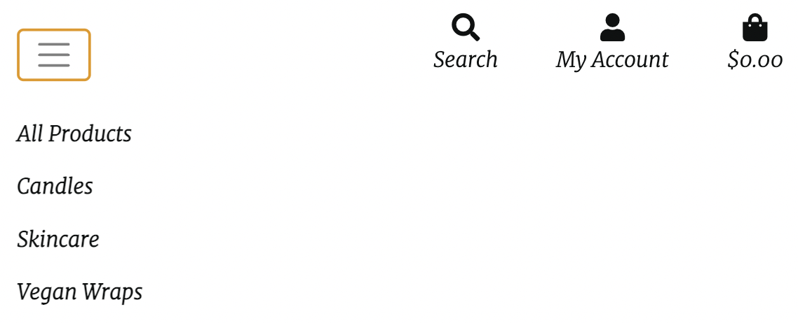

Link to live project.

This is the final portfolio project that will finalize the Full Stack Software Development Program at the Code Institute.

The requirements were to build a full-stack framework based around business logic used to control a centrally-owned dataset" using the technologies: HTML, CSS, JavaScript, Python+Django with a relational database and using the Stripe payments system.

Based on the above requirements, this ecommerce website was created to showcase a variety of Beeswax products that exist on the market in one place. The Honey Hive works with independent and small creators and businesses to build the products & brands for the website.

Beeswax products have been increasing in popularity over the last number of years but there is a gap in the market for a website that sells a host of brands of all the different products and brands. 

## **Project goals** 

* Develop an e-commerce website to sell multiple beeswax brand products in one place.
* Create an Admin access account on the platform to allow the company to make the required changes to the data sets in the database
* Produce a secure and comprehensive backend structure, including database hosting any data stored online
* Build a smart and responsive web app to enable users to view displayed information easily
* Handle any errors in such a way to help the user understand the issue and provide an easy form of contact if any error should persist

## **Business goals**

* To sell beeswax products 
* To promote the product and brand range of beeswax products to new and existing customers with the hope of increasing basket value
* To give new and existing customer background about The HoneyHive by having and about section
* To allow the TheHoneyHive to grow by easily having the ability to add new products

## **Demographics**  

* All genders and ethnicities
* Ages 18+
* Retail purchases not commercial wholesale
 

## **Value to the Users and Customers**

* Easy access to  beeswax brands and products 
* Friendly and easy to use UI 
* Secure storage of personal information 
* See order information
* Sign up for a newsletter to be kept up to date 

## Site Owner Goals

* Promote candle shop business and increase sales candles
* Increase online status and promote the site on social media
* Encourage the uptake of organic candle

## Demographics

* All genders and ethnicities
* Ages 18+
* Retail purchases not commercial wholesale

## USER STORIES

### As a first time visitor:
* I want to easily navigate throughout the site.
* I want to understand the purpose of the site easily.
* I expect an attractive site that contributes to my good experience.
* I want the site to be accessible.
* I want the site to be responsive across all devices.

### As an unregistered visitor:
* I want to be able to search and filter products easily and efficiently.
* I want to be able to sort and view products according to type, price and name.
* I want to be able to view product details so I can find information about price, size and description.
* I want to be able to add products to my shopping basket.
* I want to be able to view my shopping basket.
* I want to be able to edit my shopping basket.
* I want to be able to view the total cost of my basket.
* I want to be able to complete the checkout process and be able to enter payment information easily.
* I want to be able to view a confirmation of my order once the checkout process is complete.
* I want to be able to receive an email confirmation of my order.
* I want to be able to register easily for an account.
* I want to be able to access the blog posts.

### As a registered visitor:
* I want to be able to receive a confirmation email upon registration.
* I want to be able to view my personalized profile.
* I want to be able to save and edit personal information on my profile.
* I want to be able to view my order history.
* I want to be able to login and logout with ease.
* I want to be able to leave reviews on products.
* I want to be able to edit or delete my reviews.
* I want to be able to leave comments on the blog posts.
* I want to be able to edit or delete comments on blog posts.
* I want to be able to delete my account.
* I want to be able to change my password to keep my account secure.
* I want to be able to reset my password if I forget it.

### As a returning visitor:
* I want to be able to find social media links.
* I want to be able to contact the site owner if I have any queries.
* I want to enjoy using the site without never ending scrolling.

### As a superuser:
* I want to be able to add new products.
* I want to be able to edit or delete existing products.
* I want to be able to add new categories.
* I want to be able to add new blog posts.
* I want to be able to edit or delete existing blog posts.
* I want to be able to delete blog comments left by users.
* I want to be able to delete user reviews left on products.
* I want to be able to access the Django admin portal easily
* I want to be able to delete a user.
* I want to be able to make another user admin.
* I want to be notified when a user fills out the contact form, so I don't have to check the admin portal constantly.

## Wireframes

* Desktop 
* Mobile
* Tablet

## **Technologies used**

 Languages and Libraries

- [Django](https://www.djangoproject.com/) - Python Framework
- [HTML5](https://developer.mozilla.org/en-US/docs/Glossary/HTML5) - Programming Language
- [CSS 3](https://developer.mozilla.org/en-US/docs/Web/CSS) - Programming Language
- [JavaScript](https://developer.mozilla.org/en-US/docs/Web/JavaScript) - Programming Language
- [Python](https://www.python.org/) - Programming Language
- [Jinja](https://jinja.palletsprojects.com/en/3.0.x/) - Template Language
- [jQuery](https://jquery.com/) - JavaScript Library
- [Bootstrap v4](https://getbootstrap.com/) - Library Import
- [Google Fonts](https://fonts.google.com/) - Typography Import
- [Font Awesome](https://fontawesome.com/) - Icon provider
- [Hover.CSS](https://ianlunn.github.io/Hover/) - Hover.CSS

 IDE and Version Control

- [Git Pod](https://gitpod.io/) - IDE (Integrated Development Environment)
- [Git](https://git-scm.com/) - Version Control Tool
- [Github](https://github.com/) - Cloud based hosting service to manager my Git Repositories
- [Code Institute GitPod Template](https://github.com/Code-Institute-Org/gitpod-full-template) - Provides GitPod extensions to help with code production

 Design and Development

- [Google Chrome Development Tools](https://developer.chrome.com/docs/devtools/) - Design/Development Tools
- [Balsamiq](https://balsamiq.com/) - Wireframe designer software
- [Coolors](https://coolors.co/) - Colour scheme generator
- [Lucid App](https://lucid.app/) - Diagram creator
- [Draw.io](https://app.diagrams.net/) - Flow chart creator

 Validation and Testing

- [CSS Beautifier](https://www.freeformatter.com/css-beautifier.html) - Beautifying CSS Code
- [JavaScript Validator](https://beautifytools.com/javascript-validator.php) - Validating JS code
- [Am I Responsive?](http://ami.responsivedesign.is/) - Webpage Breakpoint visualizer and image generator
- [Black](https://black.readthedocs.io/en/stable/)- Code Formatter
- [W3C CSS Validation Service](https://jigsaw.w3.org/css-validator/)
- [Browser Stack Responsive Design Tester](https://www.browserstack.com/responsive)
- [Media Genesis RESPONSIVE WEB DESIGN CHECKER](https://responsivedesignchecker.com/)
- [Chrome Dev Tools](https://developer.chrome.com/docs/devtools/)
- [Lighthouse](https://developers.google.com/web/tools/lighthouse)
- [pylint](https://pylint.org/)

 Documentation

- [Markdown Table Generator](https://www.tablesgenerator.com/markdown_tables) - Markdown Table Production
- [Table Converter](https://tableconvert.com/excel-to-markdown) - Excel to Markdown table converter 

## **Testing First time User Stories**
 
  * I want to easily navigate throughout the site.
    * The website has a navbar that will allow all users to navigate around the website on any device 
        * Desktop Nav
        

        * Mobile Nav
        
---------------------------------------------------------------------------------------------------------------------------
 * I want to understand the purpose of the site easily.
    * On the homepage there is an 'About' section which tells the story about what The HoneyHive is about 
    * The Homescreen image allow website visitors about what the purpose of the website.
---------------------------------------------------------------------------------------------------------------------------

* I expect an attractive site that contributes to my good experience.
    * The colours, style and layout have been choosen to enure a good user expierence. 
    * Design aspects and products have been taken from other Beeswas websites - see credits for more information

---------------------------------------------------------------------------------------------------------------------------

* I want the site to be accessible.
    * All anchor links have aria-labels, images have alt attributes and the colours pass the Lighthouse accessibility checks. 
    * Placeholders and form labels have been used throughout to ensure accesbility is available throughout the site. 

---------------------------------------------------------------------------------------------------------------------------

* I want the site to be responsive across all devices.
    * Throughout development responsiveness has been considered. 
    * Using Bootstrap and media queries the site is accessible across all devices.

---------------------------------------------------------------------------------------------------------------------------

### Overview of First time user stories 

 the stories have been staisfied for each story set out for first time users 

---------------------------------------------------------------------------------------------------------------------------

## **Testing Unregistereds User Stories** 

* I want to be able to search and filter products easily and efficiently.
    * A searchbar input field allows users to search by product, description or category. 
    * Product category badges allow users to filter which category they want to look at. 
    * Navbar dropdown menus have categories listed so users can easily filter which products users want to look at. 

---------------------------------------------------------------------------------------------------------------------------

* I want to be able to sort and view products according to type, price and name.
    * The sort selector dropdown allows users to sort products based on price, name or category

---------------------------------------------------------------------------------------------------------------------------

* I want to be able to view product details so I can find information about price, size and description.
    * The product detail page displays product information clearly for the user

---------------------------------------------------------------------------------------------------------------------------

* I want to be able to add products to my shopping basket.
    * On the product detail page an 'Add to basket' button allows users to add products to their bags.

---------------------------------------------------------------------------------------------------------------------------

* I want to be able to view my shopping basket.
    * Users can click on shopping basket icon in navbar or 'Proceed to basket' button on toast message. 
    * The basket page displays all products added to basket and an order summary.

---------------------------------------------------------------------------------------------------------------------------

* I want to be able to edit my shopping basket.
    * A quantity selector dropdown allows users to change the quantity and use the update link to update the amount. 
    * The remove link allows users to remove item completely from their basket

---------------------------------------------------------------------------------------------------------------------------

* I want to be able to view the total cost of my basket.
    * In the shopping basket page the total cost with breakdown of order total and delivery cost are displayed. 
    * Total cost of basket is also displayed in toast messages if the user is not on the basket or profile pages. 

---------------------------------------------------------------------------------------------------------------------------

* I want to be able to complete the checkout process and be able to enter payment information easily.
    * The checkout page displays checkout form. This is clearly labelled with input labels and placeholders.
    * Stripe card payment section is available for card payments

---------------------------------------------------------------------------------------------------------------------------

* I want to be able to view a confirmation of my order once the checkout process is complete.
    * The checkout success page displays an order confirmation for the user.

---------------------------------------------------------------------------------------------------------------------------

## **Testing Registered User Stories** 

* I want to be able to receive an email confirmation of my order. 
    * Following a successful order an order confirmation email is sent.

---------------------------------------------------------------------------------------------------------------------------

* I want to be able to register easily for an account.
    * In the user dropdown menu, users can select to register for an account
    * The register account form is simple and clearly labelled

---------------------------------------------------------------------------------------------------------------------------

* I want to be able to receive a confirmation email upon registration.
    * Users receive a confirmation email to verify their email address

---------------------------------------------------------------------------------------------------------------------------

* I want to be able to view my personalized profile.
    * Users can view their profile, which has personal information and order history saved

---------------------------------------------------------------------------------------------------------------------------

* I want to be able to save and edit personal information on my profile.
    * Users can save default information to their profile
    * Users can edit this at any point

---------------------------------------------------------------------------------------------------------------------------

* I want to be able to view my order history.
    * On the users profile page, users can view their order history

---------------------------------------------------------------------------------------------------------------------------

* I want to be able to login and logout with ease.
    * Users select the dropdown to login, which takes them to the login form. 
    * Users can select the dropdown to logout, or if on the profile page their is a logout button.

---------------------------------------------------------------------------------------------------------------------------

* I want to be able to change my password to keep my account secure.
    * Under 'My Account' on the profile page, users can change their password.

---------------------------------------------------------------------------------------------------------------------------

* I want to be able to reset my password if I forget it.
    * On the login page, users can click a link to reset their password if they have forgotten it.

---------------------------------------------------------------------------------------------------------------------------

* I want to be able to delete my account.
    * Under 'My Account' on the profile page, users can delete their account

---------------------------------------------------------------------------------------------------------------------------

## **Testing Returning User Stories**

* I want to be able to find social media links.
    * In the footer, across all pages, users can find links to the sites social media accounts

---------------------------------------------------------------------------------------------------------------------------

* I want to be able to contact the site owner if I have any queries.
    * In the footer, across all pages, their is a link to the contact form

---------------------------------------------------------------------------------------------------------------------------

* I want to enjoy using the site without never ending scrolling.
    * In the footer, across all pages, their is a 'Back to top' link

---------------------------------------------------------------------------------------------------------------------------

## **Testing Superuser Userstories** 

* I want to be able to add new products.
    * From the navbar dropdown or in the profile page, superusers can add new products

---------------------------------------------------------------------------------------------------------------------------

* I want to be able to edit or delete existing products.
    * On the products page and each product detail page, edit and delete links allow superusers to edit or delete products. 

---------------------------------------------------------------------------------------------------------------------------

* I want to be able to add new categories.
    * In the admin portal, accessed from the admin navlink, superusers can add new categories. 

---------------------------------------------------------------------------------------------------------------------------

* I want to be able to access the Django admin portal easily
    * In the superuser user option dropdown there is a link to the admin portal

---------------------------------------------------------------------------------------------------------------------------

* I want to be able to delete a user.
    * In the admin portal, superusers can delete any user.

---------------------------------------------------------------------------------------------------------------------------

* I want to be able to make another user admin.
    * In the admin portal, superusers can make other users admin

---------------------------------------------------------------------------------------------------------------------------

* I want to be notified when a user fills out the contact form, so I don't have to check the admin portal constantly.

## **Testing User stories Over view**

|  User Story | Comments  |
|---|---|
| As a first time visitor:  | After troughly testing these stories it is clear a first time user of the site will be able to use the site as intended. The user stories set out initally have been statisfied  |
|  As an unregistered visitor: | After troughly testing these stories it is clear a first time user of the site will be able to use the site as intended. The user stories set out initally have been statisfied   |
|  As a registered visitor: | After troughly testing these stories it is clear a first time user of the site will be able to use the site as intended. The user stories set out initally have been statisfied  |
| As a returning visitor: | After troughly testing these stories it is clear a first time user of the site will be able to use the site as intended. The user stories set out initally have been statisfied |
| As a superuser: | After troughly testing these stories it is clear a first time user of the site will be able to use the site as intended. The user stories set out initally have been statisfied |

