[Link to live project](https://the-honey-hive.herokuapp.com/).

This is the final portfolio project that will finalize the Full Stack Software Development Program at the Code Institute.

The requirements were to build a full-stack framework based around business logic used to control a centrally-owned dataset" using the technologies: HTML, CSS, JavaScript, Python+Django with a relational database and using the Stripe payments system.

Based on the above requirements, this ecommerce website was created to showcase a variety of Beeswax products that exist on the market in one place. The Honey Hive works with independent and small creators and businesses to build the products & brands for the website.

Beeswax products have been increasing in popularity over the last number of years but there is a gap in the market for a website that sells a host of brands of all the different products and brands. 

## **Project goals** 

* Develop an e-commerce website to sell multiple beeswax brand products in one place.
* Create an Admin access account on the platform to allow the company to make the required changes to the data sets in the database
* Produce a secure and comprehensive backend structure, including database hosting any data stored online
* Build a smart and responsive web app to enable users to view displayed information easily
* Handle any errors in such a way to help the user understand the issue and provide an easy form of contact if any error should persist

## **Business goals**

* To sell beeswax products 
* To promote the product and brand range of beeswax products to new and existing customers with the hope of increasing basket value
* To give new and existing customer background about The HoneyHive by having and about section
* To allow the TheHoneyHive to grow by easily having the ability to add new products

## **Demographics**  

* All genders and ethnicities
* Ages 18+
* Retail purchases not commercial wholesale
 

## **Value to the Users and Customers**

* Easy access to  beeswax brands and products 
* Friendly and easy to use UI 
* Secure storage of personal information 
* See order information
* Sign up for a newsletter to be kept up to date 

## Strategy Plane

## Site Owner Goals

* Promote candle shop business and increase sales candles
* Increase online status and promote the site on social media
* Encourage the uptake of organic candle

## Demographics

* All genders and ethnicities
* Ages 18+
* Retail purchases not commercial wholesale

## USER STORIES

### As a first time visitor:
* I want to easily navigate throughout the site.
* I want to understand the purpose of the site easily.
* I expect an attractive site that contributes to my good experience.
* I want the site to be accessible.
* I want the site to be responsive across all devices.
* I want to be able to subscribe to The HoneyHive newsletter

### As an unregistered visitor:
* I want to be able to search and filter products easily and efficiently.
* I want to be able to sort and view products according to type, price and name.
* I want to be able to view product details so I can find information about price, size and description.
* I want to be able to add products to my shopping basket.
* I want to be able to view my shopping basket.
* I want to be able to edit my shopping basket.
* I want to be able to view the total cost of my basket.
* I want to be able to complete the checkout process and be able to enter payment information easily.
* I want to be able to view a confirmation of my order once the checkout process is complete.
* I want to be able to receive an email confirmation of my order.
* I want to be able to register easily for an account.

### As a registered visitor:
* I want to be able to receive a confirmation email upon registration.
* I want to be able to view my personalized profile.
* I want to be able to save and edit personal information on my profile.
* I want to be able to view my order history.
* I want to be able to login and logout with ease.
* I want to be able to delete my account.
* I want to be able to change my password to keep my account secure.
* I want to be able to reset my password if I forget it.
* I want to receive a confirmation email when I submit an enquiry message on the contact page

### As a returning visitor:
* I want to be able to find social media links.
* I want to be able to contact the site owner if I have any queries.
* I want to enjoy using the site without never ending scrolling.

### As a superuser:
* I want to be able to add new products.
* I want to be able to edit or delete existing products.
* I want to be able to add new categories.
* I want to be able to access the Django admin portal easily
* I want to be able to delete a user.
* I want to be able to make another user admin.
* I want to be notified when a user fills out the contact form, so I don't have to check the admin portal constantly.

## Scope Plane

#### Existing Features

During the initial strategy planning, the opportunities of the site were determined and values were given according to their importance and viability ranking between 1 and 5. Below are the list of features that were valued important and viable at this stage. The remaining features have been recorded in ‘Features Left to Implement’.

**Design**

* Responsive design
* Easy navigation throughout, nav links clearly labeled or icons used in navbar. Sidenav is used for smaller devices.
* Site logo - returns user to the home page
* Nav link options will change depending on status of user eg. unregistered, registered or admin
* On the home page a selection of photos will be displayed that link to different sections of the site, aimed to promote certain products or lines that are in season
* On larger screens a hover effect over some images will display an image and call to action button. On smaller screens this will be displayed at all times.

**Products**

* Users are able to search and filter products depending on what they are looking for
* Users can add products to shopping basket
* Users can update or delete products from shopping basket
* Users can securely purchase product(s) from the site
* Order confirmation will be displayed to the user and subsequent confirmation email sent.
* Registered users can leave reviews on products
* Registered users can edit or delete their reviews
* Register, Login and Logout
* Users are able to register for an account
* Registered users can login and logout of account
* Users will receive confirmation emails for registering, order summary and contact enquiries.
* Registered users can change their password if forgotten
* Registered users can view profile containing personal information and order history
* Registered users can save and update personal information on their profile

**Admin**

* Admin users can add, update and delete products
* Admin users can create new categories
* Admin users can add, update and delete blog posts
* Admin users can delete user comments on blog posts
* Admin users can delete user reviews on products
* Admin users can delete users
* Admin users can make other users admin
* Admin users are notified by email when a user fills out the contact form

**Other**

* Users can contact site owner through contact form
* If user is logged in, contact form will pre-populate
* Social media links displayed
* Back to top button in footer, to prevent unnecessary scrolling
* All users can view blog posts, if logged in users can leave comments
* Deletion confirmation before anything is deleted, to prevent accidental deletion
* Cancel buttons on all edit pages, incase user changes their mind

**Future Features to implement**

* A save feature so customers can save products to their wish list
* Expand product range and categories 
* A testimonial page for customers to see reviews 
* Out of stock notifications when products are out of stock with the option to receive an email notification when the item is back in stock
* The funcionality for Superusers to send mail message to users to subsribe to the the news letter from the admin panel
    * This was originally in the plan for this version of the website, but due to time contstraints it had to be taken out. See code below:
        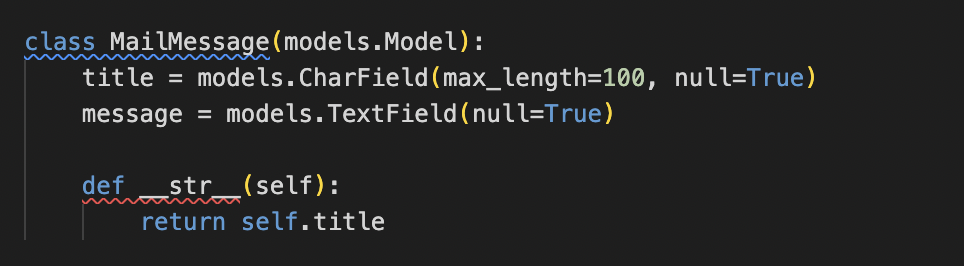
        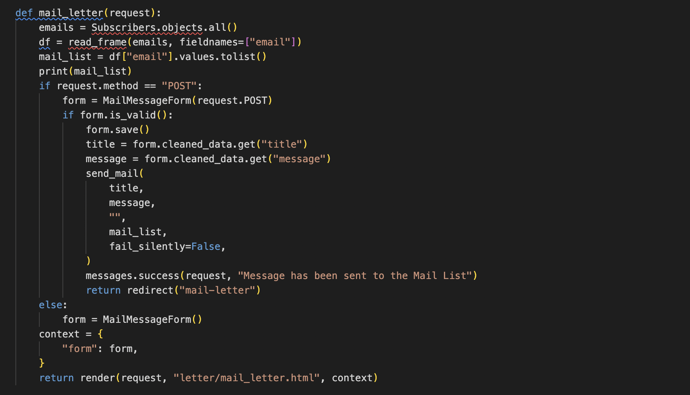
        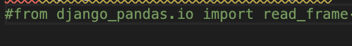

## Structure plan

Data schema form 

### Wireframes

* Desktop 
* Mobile
* Tablet

Changes to wireframes 

## Surface Plane 

### Color Scheme
 * The color scheme was the way to choose given the nature of the products, yellow and black were going to play a big part in the website design. A softer black and brighter yellow was chosen. The softer black was easier on they eyes then #000 (standard black). A white background and base for each page was chosen for its crisp and clean look. Coolors was used to try generate a 3rd color but none were standing out as a winner

    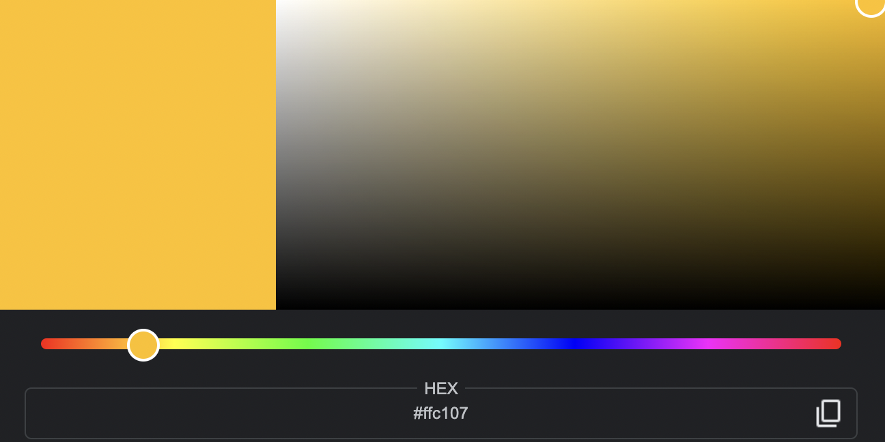

    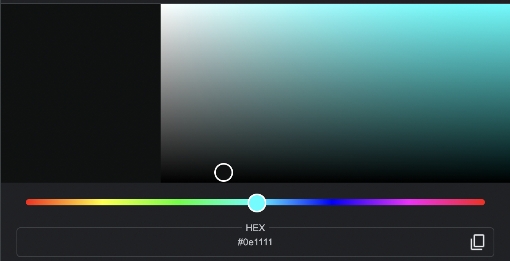

### Images
* The hero image was taken from google. It was decided that the big jar of honey would best represent all the products that would be on the site as they all stemmed from bees and honey.
* All product images were taken from existing beeswax e-commerce websites. See credit section for more information. 

### Typography
To ensure easy reading, consistency and a good user experience, I have chosen 'Meriweather’  for the font of the entire site. This font is playful, easy to read and goes well with the theme.

### Content
By website creator. The 'About' section was written by the website creator to reflect the porpose of the website.

### Readme.MD
* Past projects from my slack team mates
* Boutique Ado | check out | bag | profile | order
* W3 Schools for landing page 

## **Technologies used**

 Languages and Libraries

- [Django](https://www.djangoproject.com/) - Python Framework
- [HTML5](https://developer.mozilla.org/en-US/docs/Glossary/HTML5) - Programming Language
- [CSS 3](https://developer.mozilla.org/en-US/docs/Web/CSS) - Programming Language
- [JavaScript](https://developer.mozilla.org/en-US/docs/Web/JavaScript) - Programming Language
- [Python](https://www.python.org/) - Programming Language
- [Jinja](https://jinja.palletsprojects.com/en/3.0.x/) - Template Language
- [jQuery](https://jquery.com/) - JavaScript Library
- [Bootstrap v4](https://getbootstrap.com/) - Library Import
- [Google Fonts](https://fonts.google.com/) - Typography Import
- [Font Awesome](https://fontawesome.com/) - Icon provider
- [Hover.CSS](https://ianlunn.github.io/Hover/) - Hover.CSS

 IDE and Version Control

- [Git Pod](https://gitpod.io/) - IDE (Integrated Development Environment)
- [Git](https://git-scm.com/) - Version Control Tool
- [Github](https://github.com/) - Cloud based hosting service to manager my Git Repositories
- [Code Institute GitPod Template](https://github.com/Code-Institute-Org/gitpod-full-template) - Provides GitPod extensions to help with code production

 Design and Development

- [Google Chrome Development Tools](https://developer.chrome.com/docs/devtools/) - Design/Development Tools
- [Balsamiq](https://balsamiq.com/) - Wireframe designer software
- [Coolors](https://coolors.co/) - Colour scheme generator
- [Draw.io](https://app.diagrams.net/) - Flow chart creator

 Validation and Testing

- [CSS Beautifier](https://www.freeformatter.com/css-beautifier.html) - Beautifying CSS Code
- [JavaScript Validator](https://beautifytools.com/javascript-validator.php) - Validating JS code
- [Am I Responsive?](http://ami.responsivedesign.is/) - Webpage Breakpoint visualizer and image generator
- [Black](https://black.readthedocs.io/en/stable/)- Code Formatter
- [W3C CSS Validation Service](https://jigsaw.w3.org/css-validator/)
- [Browser Stack Responsive Design Tester](https://www.browserstack.com/responsive)
- [Media Genesis RESPONSIVE WEB DESIGN CHECKER](https://responsivedesignchecker.com/)
- [Chrome Dev Tools](https://developer.chrome.com/docs/devtools/)
- [Lighthouse](https://developers.google.com/web/tools/lighthouse)
- [pylint](https://pylint.org/)

 Documentation

- [Markdown Table Generator](https://www.tablesgenerator.com/markdown_tables) - Markdown Table Production
- [Table Converter](https://tableconvert.com/excel-to-markdown) - Excel to Markdown table converter 

## **Testing User Stories**

* Test can be found here 

## Challenges
* There were a few issues when it came to deployed the site. 
    * A spelling error in the Procfile had resulted in a failed deployement
    * Then a 'Bad request' rendered when deployed, this was resolved by updating the main Urls.py and settings file with the following code
        * urlpatterns += static(settings.STATIC_URL, document_root=settings.STATIC_ROOT)
        * urlpatterns += static(settings.MEDIA_URL, document_root=settings.MEDIA_ROOT)
* Confirmation emails were not triggering when an order was compeleted. This was because the the webhook endpoint was missing a '/' at the end. 
* The product images were not showing on the deployed site, and after completing the loaddata commands, the products still were not showing. There were some ',' missing from the json file that caused this. 
* Time was a challenge as not everyhting that had intededed to be included could be included to to submission deadline

## Deployment 

### Creation

* Following logging into my GitHub account, I created the repository from Code Institute's Gitpod Template. Select 'Use this template', fill in the repository name and create a repository.
     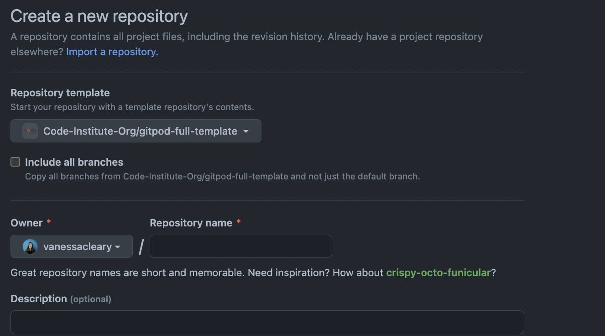

### Forking
* Sign into your GitHub account and go to this repository.
* In the top right there are several options, including 'fork'. Select this to fork the repository.
    

### Cloning
* Sign into your GitHub account and go to this [repository](https://github.com/vanessacleary/the-honey-hive). In addition to the cloning steps you will need to follow steps for setting up AWS, Stripe and Heroku.
* Clone using command line
* Select button 'Code' next to Gitpod button and copy the URL
     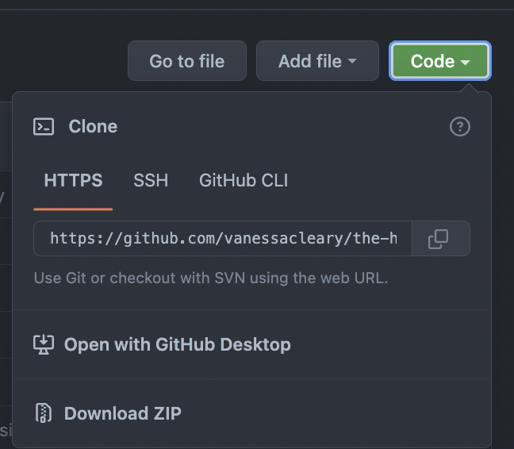
* In your workspace terminal type 'git clone' followed by the URL and press enter
* Clone using Desktop GitHub
* If you select this, it will guide you through the necessary steps
* For more information on troubleshooting see the GitHub documentation [here](https://docs.github.com/en/repositories/creating-and-managing-repositories/cloning-a-repository#about-cloning-a-repository).

### Setting up the Project

* The project has a set of requirements needed for the project to run. You can install these with pip3 install. The requirements are below.
* If you have cloned the project then you can use pip3 install -r requirements and it will install all requirements needed
* Create a SECRET_KEY. I used a [Django Secret Key Generator](https://miniwebtool.com/django-secret-key-generator/).
* The settings.py file is set up to collect keys from the environment. During development these were stored in my Gitpod dashboard. Name the variables accordingly. DEVELOPMENT is set to True.
 *   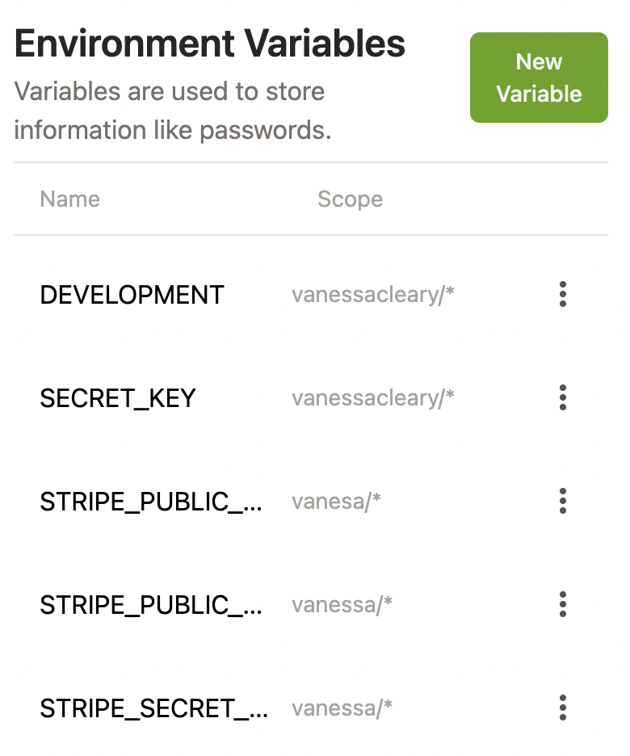
* Requirements.txt and Procfile are necessary for Heroku deployment. Make sure these have been committed and pushed before deployment. Use command pip3 freeze > requirements.txt to ensure the file is up to date.
* During development migrations need to be run using commands:
    * python3 manage.py makemigrations --dry-run
    * python3 manage.py makemigrations
    * python3 manage.py migrate --plan
    * python3 manage.py migrate
* To create a superuser use the command python3 manage.py createsuperuser and follow the steps

### Setting up AWS
* First you need to register for an account if you don't already have one. I am using the Free Tier.
* Once created, search S3, select and create bucket
* Fill in the bucket name, select nearest region and unselect 'block all public access' checkbox. Then select to create bucket
* Once created
    * Go to Properties section and go to Static Web Hosting, select Edit and Enable and enter default values for index and error documents and click Save.
    * On permissions tab, paste this configuration into CORS section

        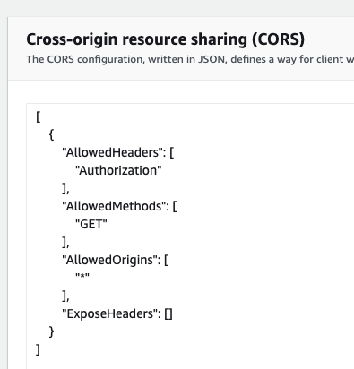
     
    * Go to Bucket Policy section and select 'policy generator'

        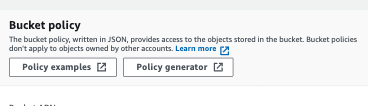

    * In the policy generator select 'S3 Bucket Policy' for type, enter a (*) into 'Principal' input and select 'Get Object' from Actions Dropdown.
    * Copy Amazon Resource Number (ARN) from the previous tab and paste into ARN box. Select 'Add Statement' and then 'Generate Policy'.
    * Copy policy and paste in Bucket Policy Editor and add a (/*) onto the end of the resource key and click save.
    * Go to the Access Control List and click Edit. Check Everyone(Public Access) and confirm you understand the changes.
    * Search for IAM in AWS Services and click 'User Groups' and select to create a new group
    * Give the group a name and click 'Next Step' until 'Create Group', select this.
    * On the menu select 'Policies' and then 'Create Policy' then select 'Import Policy' and search 'S3' and import 'AmazonS3FullAccess' policy.
    * Amend policy by adding your ARN as the value for resource as list in the format as follows:
        * "Arn:aws:",
        * "arn:aws:<ARN/*>",
    * Click 'Next: Tags' and 'Next: Review'
    * Provide policy name and click 'Create Policy'
    * Go to the IAM menu and select 'Users' and add users. Fill in the name and select 'Access key- Programmatic Access'.
    * Add a user to the group, by selecting the user. Select 'Next' and 'Create User'.
    * Download CSV file, as this has the keys required. Once you leave this page you won't be able to download or access the keys again.
    * The AWS keys need to be added to your Heroku Config Vars. In projects settings.py replace AWS_STORAGE_BUCKET_NAME with your bucket name.
    * Back in your AWS bucket. Select bucket and click 'Create Folder', name it 'media' and create. You can now add media files to it.

### Setting up Stripe
* First you need to register for an account with Stripe, if you don't have one already.
* In the dashboard, go to the section for Developers and select 'API keys'. Here you will get your publishable and secret keys. These are not to go in version control. These can be stored in the GitHub environment during development and Heroku Config Vars if deploying.
* Next go to 'Webhooks' in the side menu. Select 'Add endpoint'
* Add the url in for the site followed by /checkout/wh/
* If deploying, you will need to create a new endpoint with the deployed URL
* Next select the events you want for the webhooks, once selected then 'Add Endpoint'.
* In your new webhook there is a signing secret. Copy this and add to variable STRIPE_WH_SECRET in the GitHub environment. When creating an endpoint for Heroku, this will create a new signing secret.

### Heroku Deployment
* Firstly login into your Heroku account.
* Select 'New' and then 'Create New App', give it a name and select the closest region and click 'Create App'.
* In Resources under Add-ons select 'Heroku Postgres'

   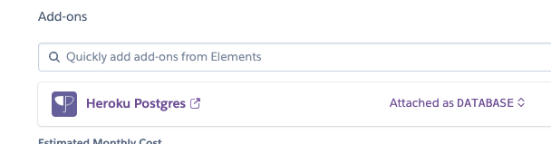

* Once the app is created, go to settings and reveal Config Vars and add the following:
* Note: the DATABASE_URL was already populated, USE_AWS is set to True and the AWS_SECRET_KEY was generated using the Django Secret Key Generator.

  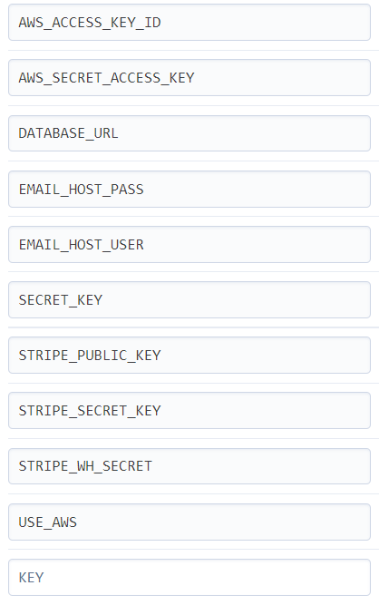

* Go to 'Deploy' and select 'Heroku Git'. Currently Heroku has stopped automatic deploys with GitHub
* Once deployed commits need to be manually pushed to both GitHub and Heroku. Using the command git push heroku main will push to Heroku
* You will need to migrate and create a superuser. Migrations can be done with the previous steps with 'heroku run' in front. E.g heroku run python3 manage.py makemigrations.

## Credits

### Product Content

* Product content for the The HoneyHive came from [Tris Honey](https://trishshoneyproducts.com/) and [Brookfield Farm](https://www.brookfield.farm/collections/irish-beeswax-candles) [Hannah's Bees](https://hannasbees.ie/)

### Code content

* README.md was used from this code institute example ready me 
* Code Institute's [Boutique Ado walkthrough project](8
https://github.com/Code-Institute-Solutions/boutique_ado_v1) was used throughout as a guide.
* The landing page was edited from the (WC schools)[https://www.w3schools.com/w3css/w3css_templates.asp]
* The footer was edit from [Surf the wave](https://github.com/anyahush/surf-the-wave)

## Awknowledgements

* Code Institute tutors and Slack community for help and guidance
* My mentor Reuben Ferrante for his help and guidance throughout
* My mini-Feb group on Slack for moral support and feedback with special thanks to Ashly Buy, Nick Lennon, Maggie Walsh and Anya McDonald

