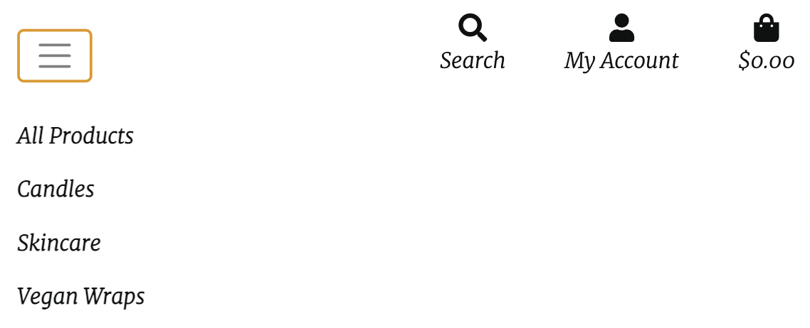
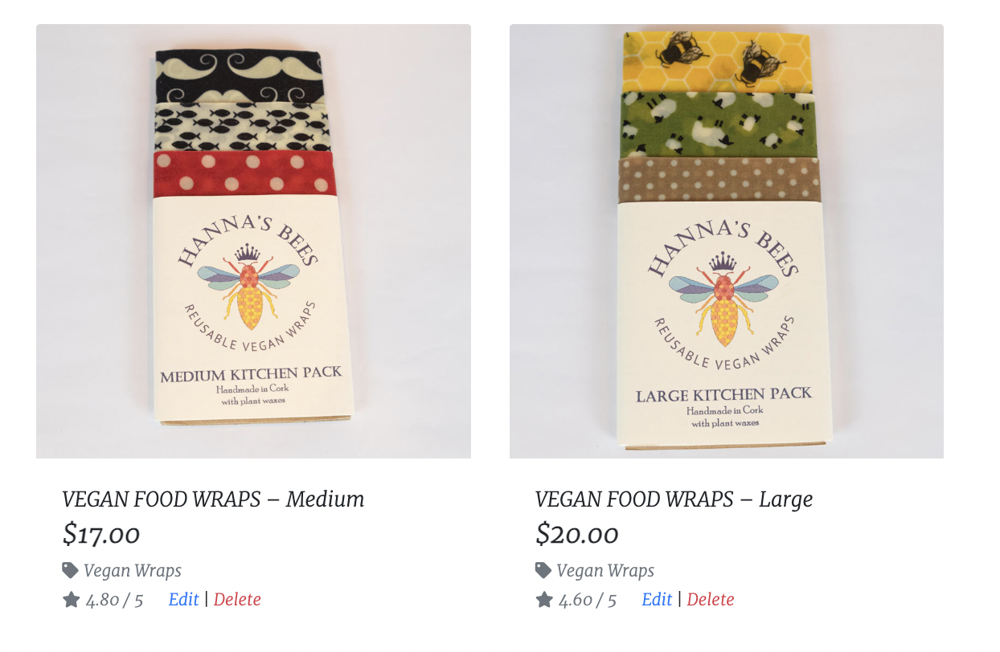

## **Testing First time User Stories**
 
  * I want to easily navigate throughout the site.
    * The website has a navbar that will allow all users to navigate around the website on any device 
        * Desktop Nav
        

        * Mobile Nav
        

---------------------------------------------------------------------------------------------------------------------------
 * I want to understand the purpose of the site easily.
    * On the homepage there is an 'About' section which tells the story about what The HoneyHive is about 
    

    * The Homescreen image allow website visitors about what the purpose of the website.
---------------------------------------------------------------------------------------------------------------------------

* I expect an attractive site that contributes to my good experience.
    * The colours, style and layout have been choosen to enure a good user expierence. 
    * Design aspects and products have been taken from other Beeswas websites - see credits for more information

---------------------------------------------------------------------------------------------------------------------------

* I want the site to be accessible.
    * All anchor links have aria-labels, images have alt attributes and the colours pass the Lighthouse accessibility checks. 
    * Placeholders and form labels have been used throughout to ensure accesbility is available throughout the site. 

---------------------------------------------------------------------------------------------------------------------------

* I want the site to be responsive across all devices.
    * Throughout development responsiveness has been considered. 
    * Using Bootstrap and media queries the site is accessible across all devices.

---------------------------------------------------------------------------------------------------------------------------

* I want to be able to subscribe to The HoneyHive newsletter
    

---------------------------------------------------------------------------------------------------------------------------

## **Testing Unregistereds User Stories** 

* I want to be able to search and filter products easily and efficiently.
    * A searchbar input field allows users to search by product, description or category. 
        

    * Product category badges allow users to filter which category they want to look at. 

          

    * Navbar dropdown menus have categories listed so users can easily filter which products users want to look at. 
    

---------------------------------------------------------------------------------------------------------------------------

* I want to be able to sort and view products according to type, price and name.
    * The sort selector dropdown allows users to sort products based on price, name or category
      

---------------------------------------------------------------------------------------------------------------------------

* I want to be able to view product details so I can find information about price, size and description.
    * The product detail page displays product information clearly for the user
       

---------------------------------------------------------------------------------------------------------------------------

* I want to be able to add products to my shopping bag.
    * On the product detail page an 'Add to basket' button allows users to add products to their bags.
      

---------------------------------------------------------------------------------------------------------------------------

* I want to be able to view my shopping basket.
    * Users can click on shopping basket icon in navbar or 'go to secure checkout' button on toast message. 
     

        

    * The bag page displays all products added to basket and an order summary.

         

---------------------------------------------------------------------------------------------------------------------------

* I want to be able to edit my shopping basket.
    * A quantity selector dropdown allows users to change the quantity and use the update link to update the amount. 
    * The remove link allows users to remove item completely from their basket
    

---------------------------------------------------------------------------------------------------------------------------

* I want to be able to view the total cost of my basket.
    * In the shopping basket page the total cost with breakdown of order total and delivery cost are displayed.
      

    * Total cost of basket is also displayed in toast messages if the user is not on the basket or profile pages. 
    

---------------------------------------------------------------------------------------------------------------------------

* I want to be able to complete the checkout process and be able to enter payment information easily.
    * The checkout page displays checkout form. This is clearly labelled with input labels and placeholders.
       

    * Stripe card payment section is available for card payments
        

---------------------------------------------------------------------------------------------------------------------------

* I want to be able to view a confirmation of my order once the checkout process is complete.
    * The checkout success page displays an order confirmation for the user.
     

      

* I want to be able to receive an email confirmation of my order. 
    * Following a successful order an order confirmation email is sent.

---------------------------------------------------------------------------------------------------------------------------

## **Testing Registered User Stories** 

* I want to be able to register easily for an account.
    * In the user dropdown menu, users can select to register for an account
        

    * The register account form is simple and clearly labelled
       

---------------------------------------------------------------------------------------------------------------------------

* I want to be able to receive a confirmation email upon registration.
    * Users receive a confirmation email to verify their email address

---------------------------------------------------------------------------------------------------------------------------

* I want to be able to view my personalized profile.
    * Users can view their profile, which has personal information and order history saved
          

---------------------------------------------------------------------------------------------------------------------------

* I want to be able to save and edit personal information on my profile.
    * Users can save default information to their profile
      

    * Users can edit this at any point
        

---------------------------------------------------------------------------------------------------------------------------

* I want to be able to view my order history.
    * On the users profile page, users can view their order history
              

---------------------------------------------------------------------------------------------------------------------------

* I want to be able to login and logout with ease.
    * Users select the dropdown to login, which takes them to the login form. 
     

     

    * Users can select the dropdown to logout

     

    
---------------------------------------------------------------------------------------------------------------------------

* I want to be able to change my password to keep my account secure.
    * Under 'My Account' on the profile page, users can change their password.

---------------------------------------------------------------------------------------------------------------------------

* I want to be able to reset my password if I forget it.
    * On the login page, users can click a link to reset their password if they have forgotten it.

     

---------------------------------------------------------------------------------------------------------------------------

* I want to be able to delete my account.
    * Under 'My Account' on the profile page, users can delete their account

---------------------------------------------------------------------------------------------------------------------------

* I want to receive a confirmation email when I submit an enquiry message on the contact page
    * An email is sent to the user who submits an enquiry through the contact page

     
     s
---------------------------------------------------------------------------------------------------------------------------

## **Testing Returning User Stories**

* I want to be able to find social media links.
    * In the footer, across all pages, users can find links to the sites social media accounts
 
    

---------------------------------------------------------------------------------------------------------------------------

* I want to be able to contact the site owner if I have any queries.
    * In the footer, across all pages, their is a link to the contact form
    
    

---------------------------------------------------------------------------------------------------------------------------

* I want to enjoy using the site without never ending scrolling.
    * In the footer, across all pages, their is a 'Back to top' link

    

---------------------------------------------------------------------------------------------------------------------------

## **Testing Superuser Userstories** 

* I want to be able to add new products.
    * From the navbar dropdown or in product management page, superusers can add new products

     

---------------------------------------------------------------------------------------------------------------------------

* I want to be able to edit or delete existing products.
    * On the products page and each product detail page, edit and delete links allow superusers to edit or delete products. 
    
    

---------------------------------------------------------------------------------------------------------------------------

* I want to be able to add new categories.
    * In the admin portal, accessed from the admin navlink, superusers can add new categories. 

      

       

---------------------------------------------------------------------------------------------------------------------------

* I want to be able to access the Django admin portal easily
    * In the superuser user option dropdown there is a link to the admin portal

---------------------------------------------------------------------------------------------------------------------------

* I want to be able to delete a user.
    * In the admin portal, superusers can delete any user.

    

---------------------------------------------------------------------------------------------------------------------------

* I want to be able to make another user admin.
    * In the admin portal, superusers can make other users admin

      

---------------------------------------------------------------------------------------------------------------------------

* I want to be notified when a user fills out the contact form, so I don't have to check the admin portal constantly.

 * When a user completes the contact form, an email is sent to the DEFAULT_FROM_EMAIl to notify the admin that someone has contacted the site

  

 * Email sent to admin, notifying of user contact

    

* The user gets a success message to let them know thier message has been sent and the will get an emails

     

---------------------------------------------------------------------------------------------------------------------------

## **Testing User stories Over view**

|  User Story | Comments  |
|---|---|
| As a first time visitor:  | After troughly testing these stories it is clear a first time user of the site will be able to use the site as intended. The user stories set out initally have been statisfied  |
|  As an unregistered visitor: | After troughly testing these stories it is clear a first time user of the site will be able to use the site as intended. The user stories set out initally have been statisfied   |
|  As a registered visitor: | After troughly testing these stories it is clear a first time user of the site will be able to use the site as intended. The user stories set out initally have been statisfied  |
| As a returning visitor: | After troughly testing these stories it is clear a first time user of the site will be able to use the site as intended. The user stories set out initally have been statisfied |
| As a superuser: | After troughly testing these stories it is clear a first time user of the site will be able to use the site as intended. The user stories set out initally have been statisfied |

## Lighthouse

### Landing page

* Desktop 

    

* Mobile

        

### Products page

* Desktop

    

* Mobile

    

## Products page

* Products Page

    

* Mobile

    

### Product Detail Page

* Desktop

    

* Mobile

    

### Product Detail Page

* Desktop

    

* Mobile

    

### Add Product Page

* Desktop

    

* Mobile

    

### Shopping bag Page

* Desktop

    

* Mobile

    

### Checkout Page

* Desktop

    

* Mobile

    

### Success Page

* Desktop

    

* Mobile

    

### Contact Page

* Desktop

    

* Mobile

    

### Subscribe Page

* Desktop

    

* Mobile

    

## Validation

### HTML Validation

* Using the (W3C)[https://validator.w3.org/] HTML validator the following errors were found:
    * There were others errors that were fixed and these were remaining. 
    * It was assumed these were fixed but the errors are still showing 
    * These will now be fixed at a later stage

### CSS Validation

* Using the (W3C)[https://jigsaw.w3.org/css-validator/] CSS validator there were no errors found with the CSS

### Python Validation

* Python validation was carried out on all Python files using PEP8 Validator. Initial errors returned were:
    * Lines too long
    * Indentation errors
    * Missing blank space at end of file
    * Missing docstrings

* Once these were resolved all Python files returned a successful validation result.

## Further Manual Testing

